### GitHub
<h3>写在前面</h3>

如何连接已有的git, 仓库 

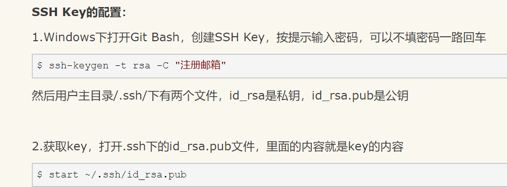
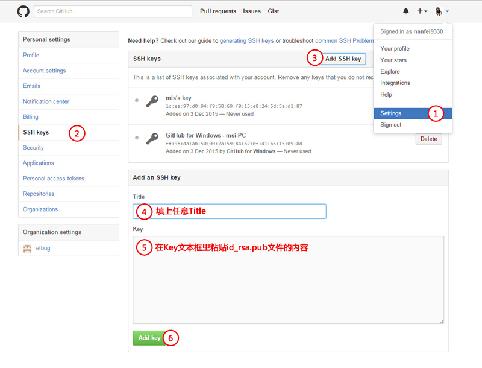
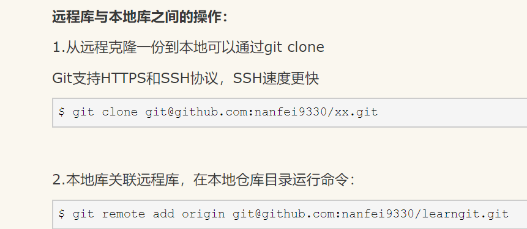
<h4> 1. 命令创建仓库</h4>

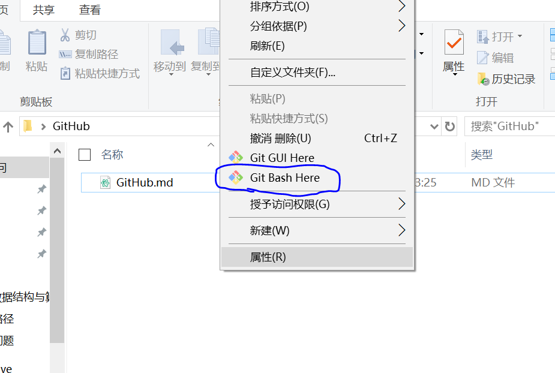
    <h6>建立一个新的仓库</h6>

   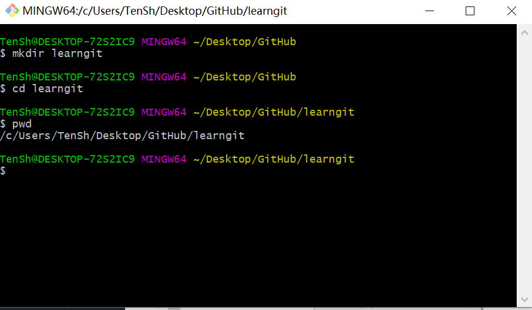
   

   $ mkdir learngit 
   $ cd learngit 
   $ pwd 
   前两个是创建一个仓库, 最后一个命令是看git在哪
   

<h4>2. 命令初始化仓库</h4>

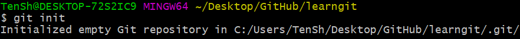

这个目录下就会出现一个.git的文件

<h6>注意事项</h6>

首先这里再明确一下，所有的版本控制系统，其实只能跟踪文本文件的改动，比如TXT文件，网页，所有的程序代码等等，Git也不例外。版本控制系统可以告诉你每次的改动，比如在第5行加了一个单词“Linux”，在第8行删了一个单词“Windows”。而图片、视频这些二进制文件，虽然也能由版本控制系统管理，但没法跟踪文件的变化，只能把二进制文件每次改动串起来，也就是只知道图片从100KB改成了120KB，但到底改了啥，版本控制系统不知道，也没法知道。

不幸的是，Microsoft的Word格式是二进制格式，因此，版本控制系统是没法跟踪Word文件的改动的，前面我们举的例子只是为了演示，如果要真正使用版本控制系统，就要以纯文本方式编写文件。

因为文本是有编码的，比如中文有常用的GBK编码，日文有Shift_JIS编码，如果没有历史遗留问题，强烈建议使用标准的UTF-8编码，所有语言使用同一种编码，既没有冲突，又被所有平台所支持。

<h4>3.提交文件</h4>

现在创建一个, read.txt 的文件 
接下来把它提交. 

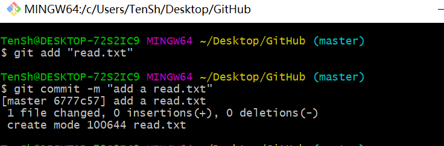
<h6>注意事项</h6>

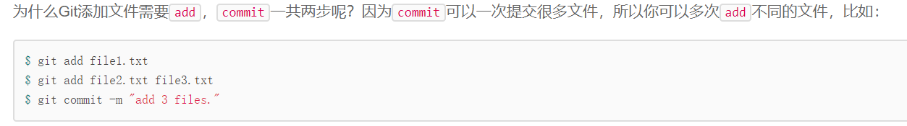

<h3>时光穿梭机</h3>

<h4>&nbsp;&nbsp;&nbsp;&nbsp;&nbsp;&nbsp;&nbsp;
版本回退
</h4>

&nbsp;&nbsp;&nbsp;&nbsp;&nbsp;&nbsp;&nbsp;&nbsp;&nbsp;&nbsp;&nbsp;&nbsp;&nbsp;
现在, 提交了三次readme.txt, 我想回到过去怎么办? 
首先可以看, 历史记录
$ git log

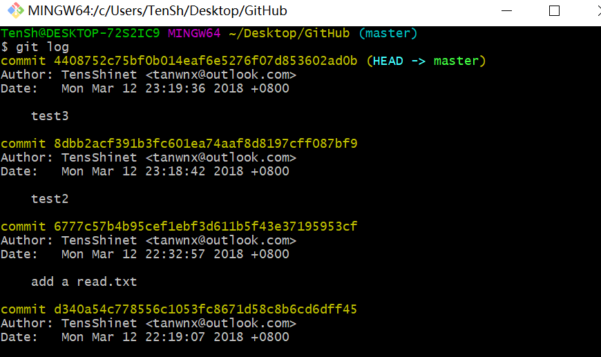

如果嫌信息太多, 可以, 输入这样一个命令
$ git log --pretty=oneline

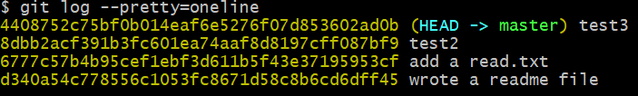
<h6>注意事项</h6>

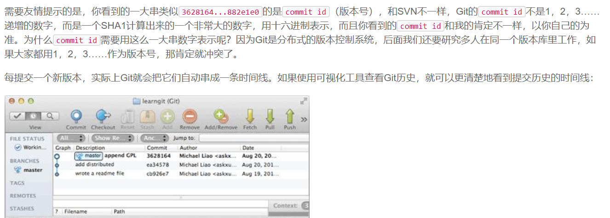

现在可以readme.txt回退到上一个版本
$ git reset --hard HEAD^

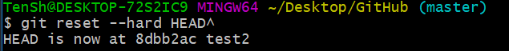

<h6>注意事项</h6>
恢复, 版本, 和 读取内容

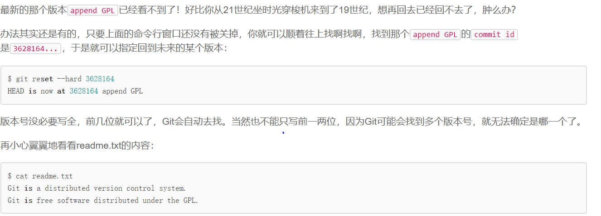
$ git reset --hard ID 
$ cat reame.txt 

恢复不记得ID的版本

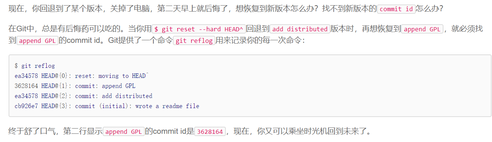
$ git reflog

<h4>&nbsp;&nbsp;&nbsp;&nbsp;&nbsp;&nbsp;&nbsp;
管理修改
</h4>

完全参考廖雪峰的文档 
连接如下: <a herf ="https://www.liaoxuefeng.com/wiki/0013739516305929606dd18361248578c67b8067c8c017b000/001374829472990293f16b45df14f35b94b3e8a026220c5000" >廖雪峰的博客</a>

<h4>&nbsp;&nbsp;&nbsp;&nbsp;&nbsp;&nbsp;&nbsp;
撤销修改
</h4>

完全参考廖雪峰的文档 
连接如下: <a herf ="https://www.liaoxuefeng.com/wiki/0013739516305929606dd18361248578c67b8067c8c017b000/001374829472990293f16b45df14f35b94b3e8a026220c5000" >廖雪峰的博客</a>

<h4>&nbsp;&nbsp;&nbsp;&nbsp;&nbsp;&nbsp;&nbsp;
给远程仓库提交代码
</h4>

1.连接远程仓库
$ git remote add origin  address 
2.$ git push -u origin master 
3. 之后, 好像可以直接提交 $ git push origin master
<h6>注意事项</h6>

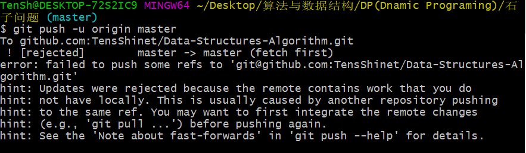
解决办法是:

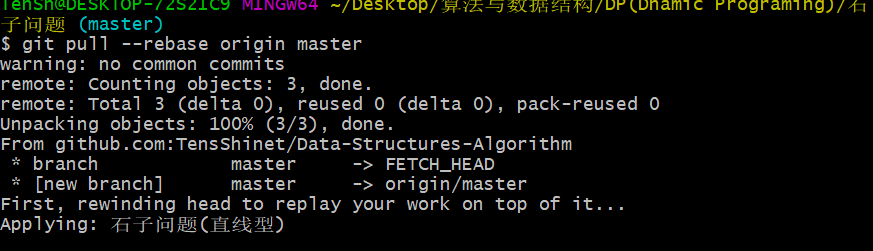

<h4>&nbsp;&nbsp;&nbsp;&nbsp;&nbsp;&nbsp;&nbsp;
克隆远程仓库并保持更新
</h4>

git clone address 
git remote add upstream adress 

<h6>同步fork</h6>

1. 从上游仓库 fetch 分支和提交点，提交给本地 master，并会被存储在一个本地分支 upstream/master 
$ git fetch upstream 
2. 切换到本地主分支(如果不在的话) 
$ git checkout master 
3. 把 upstream/master 分支合并到本地 master 上，这样就完成了同步，并且不会丢掉本地修改的内容。  
$ git merge upstream/master 
4. 如果想更新到 GitHub 的 fork 上，直接  
$ git push origin master 

<h6>注意事项</h6>

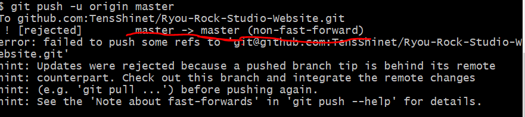
解决办法是:

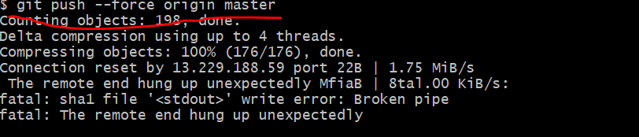
$ git push force origin master 
强行合并 
但是, 又出现了新的问题 

解决办法是: 

$ git config http.postBuffer 52428800  
可以使上传的容量变大

<h4>
删除本地仓库与远程仓库的关联
</h4>

$ git remote rm origin 
查看 
$ git remote -v

<h4>
删除远程仓库的文件
</h4>

首先先将本地仓库的文件删除, 然后提交

### 将页面在网站上显现出来

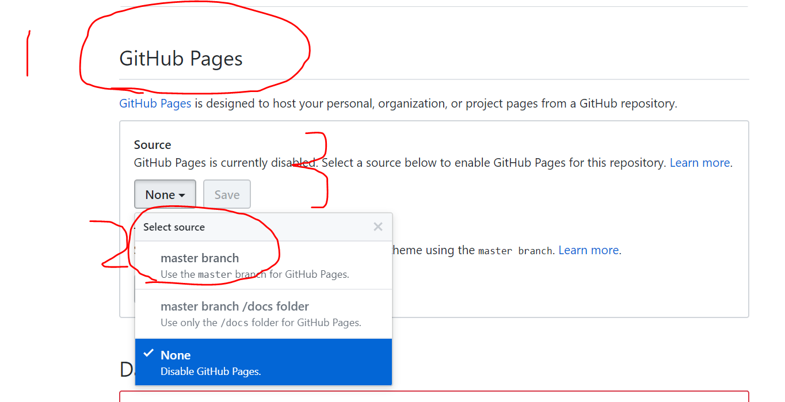

然后修改网址就可以了 超级方便
